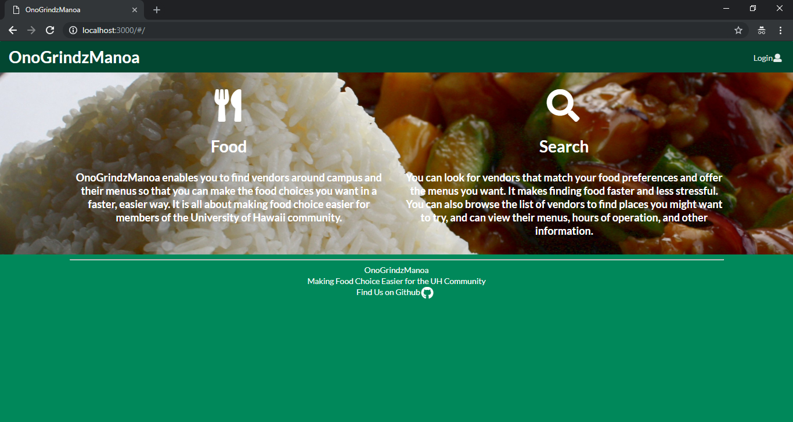
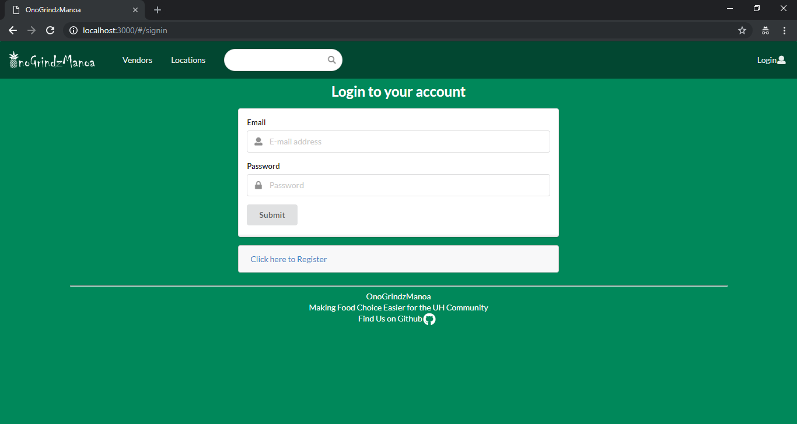
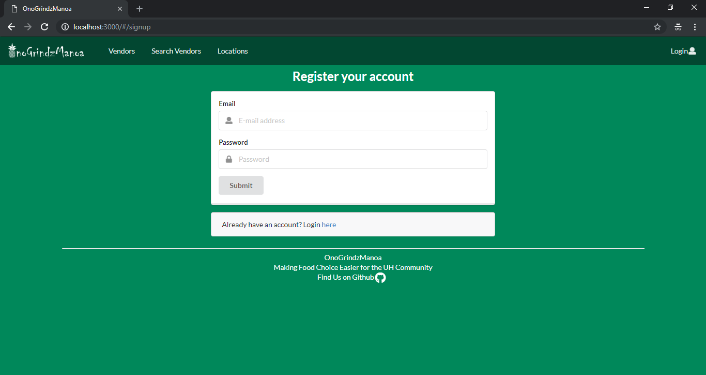
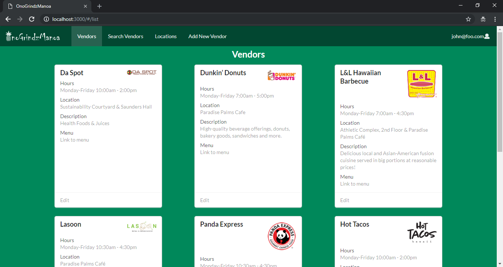
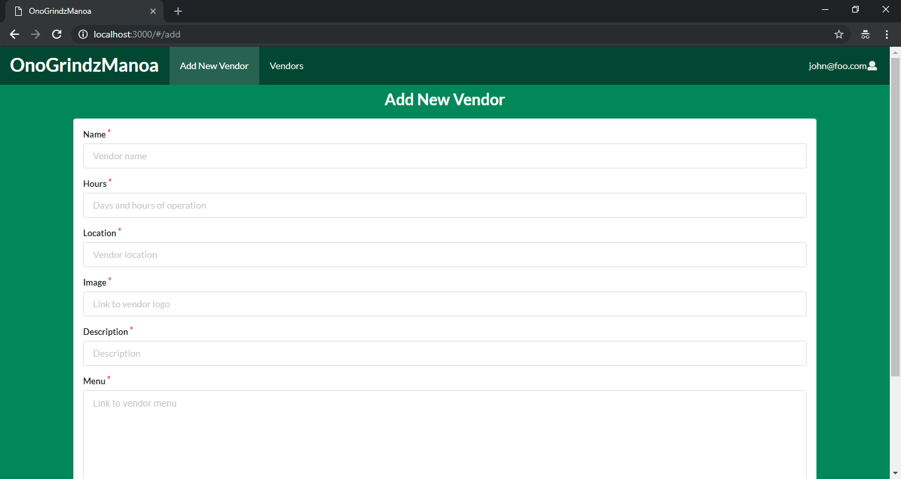

# Table of contents

* [About OnoGrindzManoa](#about-onogrindzmanoa)
* [Installation](#installation)
* [Development history](#development-history)
  * [Milestone 1: Mockup development](#milestone-1-mockup-development)

# About OnoGrindzManoa 

OnoGrindzManoa is a Meteor application currently in development with the goal of providing dining information for the University of Hawaii community. Finding food on campus is a significant challenge, especially becuase there are so many options. OnoGrindzManoa will enable users to find places to eat which match their preferences and facilitate a better dining experience for the UH Manoa commmunity. This page will be regularly updated with project information throughout the development process.
 
Once logged in, vendors will be able to create a profile that provides information about them and their menu. Users will be able to search for vendors/menus that match their preferences. Administrators will be able to manage the app and view areas which may be restricted for other users.

We also aim to provide a search function, available to those who can login to the system with their account. The search function will allow users to display all vendors with a given favorite/preference for menu, style of food, quality of service, etc.

[Visit Us on GitHub](https://github.com/onogrindzmanoa)

[Visit the App](http://onogrindzmanoa.meteorapp.com)

## Landing Page
When the user first arrives on the landing page, they are greeted and informed of what the app does and the services it offers.

[Visit](http://onogrindzmanoa.meteorapp.com/#/)

## Login
Clicking Login from the Landing page pulls up the Login window. Users can either create an account or sign in to their existing account.

[Visit](http://onogrindzmanoa.meteorapp.com/#/signin)

## Register
If users do not have an account yet, they register and can then sign in to the application.

[Visit](http://onogrindzmanoa.meteorapp.com/#/signup)

## List Vendors
The user can then navigate to the list of vendors which enables them to view each vendor's information and has links to their menus. We are working to implement the ability for users to search the database of vendors to find ones which meet their preferences.


## Add Vendor
Vendors can use this page to add/edit their information. This enables them to put their menu, location, and other information on the site.

[Visit](http://onogrindzmanoa.meteorapp.com/#/add)

# Installation

First, you will need to [install Meteor](https://www.meteor.com/install).

Second, you must [download a copy of OnoGrindzManoa](https://github.com/onogrindzmanoa/onogrindzmanoa), or clone it using github.
  
Third, command into the app/ directory using the command line and install libraries with:

```
$ meteor npm install
```

Fourth, run the system with:

```
$ meteor npm run start
```

If all goes well, the application will appear at [http://localhost:3000](http://localhost:3000). 

# Development History

The development process for OnoGrindzManoa will conform to [Issue Driven Project Management](http://courses.ics.hawaii.edu/ics314f16/modules/project-management/) practices. Development will consist of a series of Milestones whch are divided up into issues that correspond to 2-3 day tasks. GitHub projects will be used to manage the processing of tasks for each milestone.  

## Milestone 1: Mockup development

This milestone started on November 6, 2018 and ended on November 15, 2018.

The goal of Milestone 1 is to create a set of HTML pages providing a mockup of the pages in the system along with a functional landing page with a user login option. 

[See Milestone 1 on GitHub](https://github.com/onogrindzmanoa/onogrindzmanoa/projects/1)

Additional milestones will be added as the project progresses.

## Milestone 2: User Functionality

This milestone started on November 15, 2018 and will end on November 27, 2018.

The goal of Milestone 2 is to implement user functionality throughout the application and ensure working pages for vendors and users to present their menus and find matches for their preferences.

[See Milestone 2 on GitHub](https://github.com/onogrindzmanoa/onogrindzmanoa/projects/2)

# Contact Us

You can find out more about the members of the development team and contact them by visiting their sites:

* [Michael Arcangel](https://michaelgarcangel.github.io/)
* [Christian Cheshire](https://christiancheshire.github.io/)
* [Weile Lin](https://weilelin123.github.io/)
* [Derek Nishimoto](https://dereknishimoto.github.io/)

