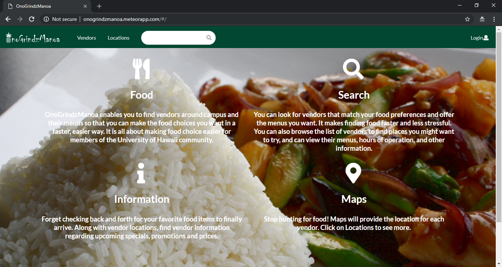
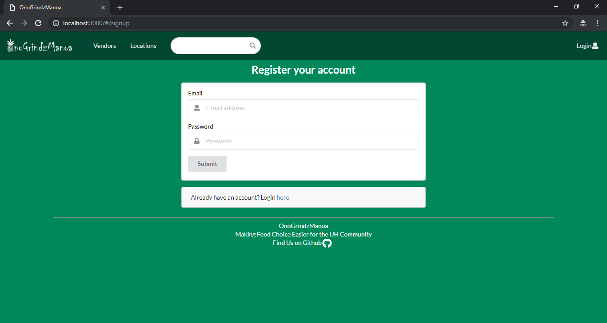
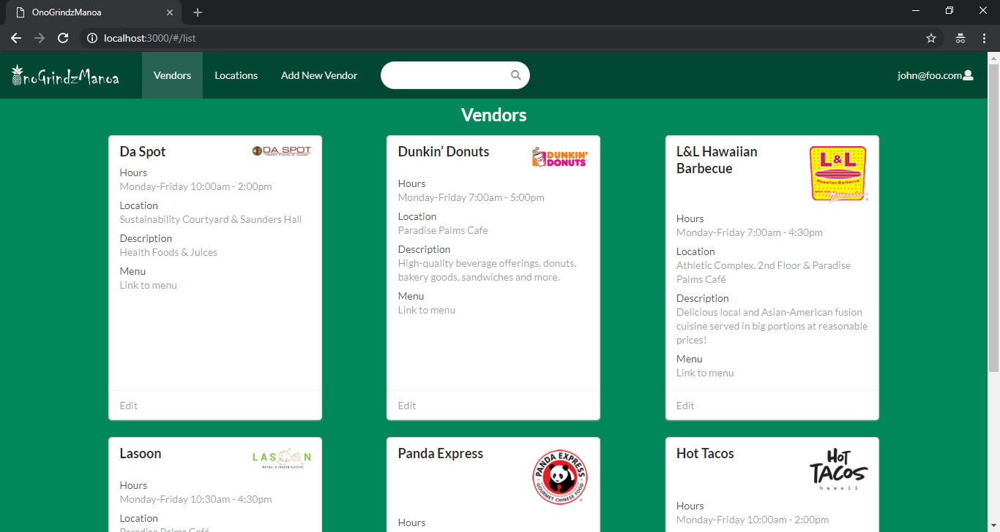
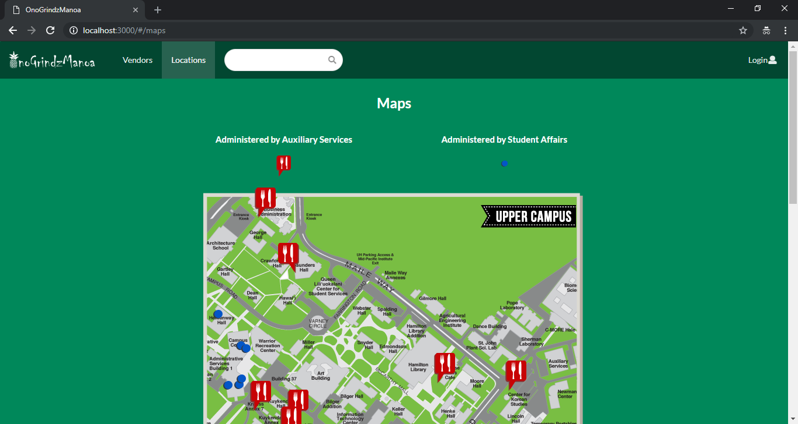
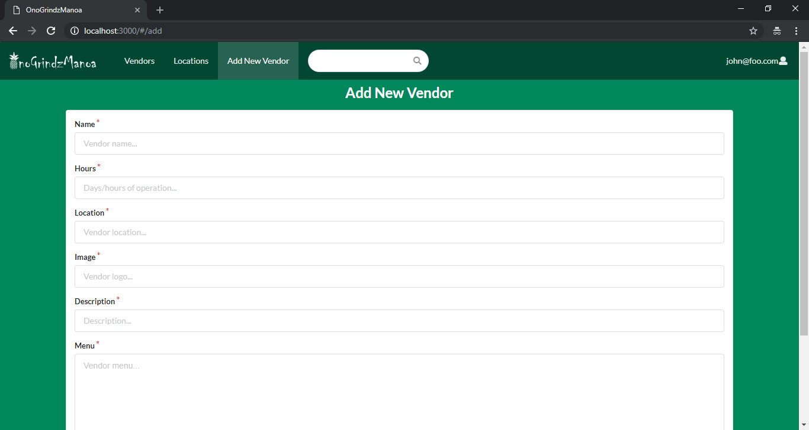
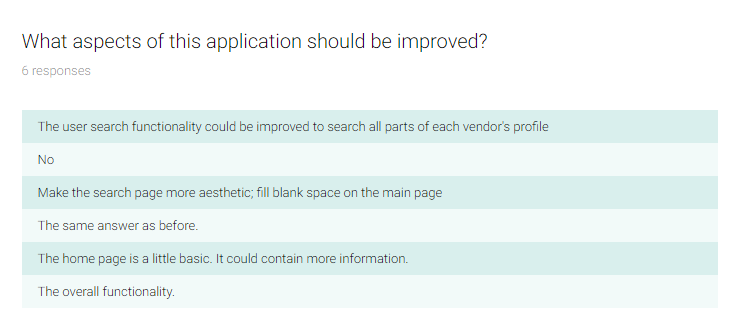

# Table of contents

* [About OnoGrindzManoa](#about-onogrindzmanoa)
* [Installation and Developer Use](#installation)
* [Development history](#development-history)
  * [Milestone 1: Mockup development](#milestone-1-mockup-development)
  * [Milestone 2: User functionality](#milestone-2-user-functionality)
  * [Milestone 3: Final product](#milestone-3-final-product)
* [Community Feedback](#community-feedback)
* [Contact](#contact-us)

# About OnoGrindzManoa 

OnoGrindzManoa is a Meteor application which provides dining information for the University of Hawaii community. Finding food on campus is a significant challenge, especially as there are so many options. OnoGrindzManoa enables users to find places to eat which match their preferences and facilitates a better dining experience for the UH Manoa commmunity. This page will be regularly updated with project information throughout the development process.

Users can access certain functions of the app publicly, but to add or edit information users/vendors must create an account and login.
 
Once logged in, vendors can create a profile that provides information about them and their menu. Users will be able to search for vendors/menus that match their preferences. Administrators can to manage the app and view areas which may be restricted for other users.

We also provide a search function, available to those who can login to the system with their account and to public users. The search function allows users to display all vendors with a given favorite/preference for menu, style of food, quality of service, etc.
[Visit the App](http://onogrindzmanoa.meteorapp.com)

## Landing Page
When the user first arrives on the landing page, they are greeted and informed of what the app does and the services it offers. From the landing page, users can navigate using the nav bar or use the search function to search for vendors.

[Visit](http://onogrindzmanoa.meteorapp.com/#/)

## Vendor List
Users can navigate to the list of vendors from the landing page. Only vendors and administrators can add or edit vendors. Users who try to edit or add a vendor will be prompted to login with their username and password. 

[Visit](http://onogrindzmanoa.meteorapp.com/#/list)

## Login
Clicking Login from the Landing page or when prompted to do so on the vendor page pulls up the Login window. Users can either create an account or sign in using their existing account. Once logged in they will be able to add/edit information.

[Visit](http://onogrindzmanoa.meteorapp.com/#/signin)

## Register
If users do not have an account yet, they register and can then sign in to the application.

[Visit](http://onogrindzmanoa.meteorapp.com/#/signup)

## Vendor List
The user can navigate to the list of vendors which enables them to view each vendor's information and access links to the user menus. We are working to implement the ability for users to search the database of vendors to find ones which meet their preferences.

[Visit](http://onogrindzmanoa.meteorapp.com/#/list)

## Vendor Locations
Users can also navigate to the map of the University of Hawaii - Manoa campus which shows the vendor locations. Our long-term goal is to enable this map to have an interactive aspect which would enable to users to click on a location and view the vendors located there.

[Visit](http://onogrindzmanoa.meteorapp.com/#/maps)

## Add New Vendor
Vendors can use this page to add/edit their information. This enables them to put their menu, location, and other information on the site as well as update it when necessary.

[Visit](http://onogrindzmanoa.meteorapp.com/#/add)

# Installation
First, you will need to [install Meteor](https://www.meteor.com/install).

Second, you must [download a copy of OnoGrindzManoa](https://github.com/onogrindzmanoa/onogrindzmanoa), or clone it using github.
  
Third, command into the app/ directory using the command line and install libraries with:

```
$ meteor npm install
```

Fourth, run the system with:

```
$ meteor npm run start
```

If all goes well, the application will appear at [http://localhost:3000](http://localhost:3000). 

# Development History

The development process for OnoGrindzManoa conforms to [Issue Driven Project Management](http://courses.ics.hawaii.edu/ics314f16/modules/project-management/) practices. Development consisted of a series of Milestones which were divided up into issues that corresponded to 2-3 day tasks. GitHub projects were be used to manage the processing of tasks for each milestone.  

## Milestone 1: Mockup development

This milestone started on November 6, 2018 and ended on November 15, 2018.

The goal of Milestone 1 was to create a set of HTML pages providing a mockup of the pages in the system along with a functional landing page with a user login option. 

[See Milestone 1 on GitHub](https://github.com/onogrindzmanoa/onogrindzmanoa/projects/1)

Additional milestones are to be added as the project progresses.

## Milestone 2: User Functionality

This milestone started on November 15, 2018 and ended on November 27, 2018.

The goal of Milestone 2 was to implement user functionality throughout the application and ensure working pages for vendors and users to present their menus and find matches for their preferences.

[See Milestone 2 on GitHub](https://github.com/onogrindzmanoa/onogrindzmanoa/projects/2)

## Milestone 3: Final Product

This milestone started on November 27, 2018 and ended on December 6, 2018.

The goal of Milestone 3 was to finalize the app by finishing the implementation of functionality for users and vendors and adding mockups of future functionality.

[See Milestone 3 on GitHub](https://github.com/onogrindzmanoa/onogrindzmanoa/projects/3)

# Community Feedback
As part of Milestone 3, the OnoGrindzTeam solicited feedback from members of the UH Community. A series of 5 questions were asked. Selected responses are displayed here.


Users responded with generally positive ratings. The average rating was between 3 and 4 on a scale of 1 to 5. 


Users responded with a variety of ideas, some of which we had already thought of as plans for further development.


Overall, users wanted more functionality which is our long-term goal.


Generally, users like the idea and goals of the app, but want to see more ideas implemented.


All users responded positively to this question, which clearly demonstrates the desire among consumers for an app that will fulfill these functions and improve the ability of the UH community to search for food options.

# Contact Us

You can find out more about the members of the development team and contact them by visiting their sites:

* [Michael Arcangel](https://michaelgarcangel.github.io/)
* [Christian Cheshire](https://christiancheshire.github.io/)
* [Weile Lin](https://weilelin123.github.io/)
* [Derek Nishimoto](https://dereknishimoto.github.io/)

